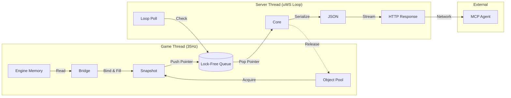

Here is the comprehensive **Final DMCP Implementation Plan v11.0**.

This plan consolidates all architectural decisions: **CPM v0.40.2** dependency management, **uWebSockets v20.74.0** for async networking, **C++17** compliance, and the **SDK + Bridge** pattern for strict engine isolation.

--- START OF FILE plan.md ---

# DMCP (Doom Model Context Protocol) - Implementation Plan

**Version**: 11.0 (Final)
**Date**: 2025-11-19
**Target Engine**: UZDoom (GZDoom Fork)
**Standard**: C++17
**Protocol**: MCP Streamable HTTP (SSE + JSON-RPC 2.0)
**Build System**: CMake + CPM (Package Manager)

---

## 1. Executive Summary

DMCP is a high-performance C++ SDK acting as a "Sidecar" to Doom engines. It exposes real-time game state to AI agents via HTTP Server-Sent Events (SSE).

**Key Technical Decisions:**
*   **Memory Model**: **Zero-Alloc Steady State**. Heavy snapshot objects (containing vectors) are recycled via an **Object Pool**. Vectors retain capacity between frames to prevent `malloc` usage during gameplay.
*   **Concurrency**: **Lock-Free SPSC Queue**. The Game Thread (Producer) and Server Thread (Consumer) exchange pointers, ensuring the game loop never blocks on network I/O.
*   **Networking**: **uWebSockets** (Async Event Loop). Handles high-frequency streaming with minimal CPU overhead compared to thread-per-connection models.
*   **Integration**: **Header-Only Bridge**. The "Adapter" is the only file that touches Engine headers. The Core SDK remains pure C++.

---

## 2. Architecture Overview



---

## 3. Layer Design

| Layer | Component | Location | Responsibility | Dependencies |
| :--- | :--- | :--- | :--- | :--- |
| **1** | **Schema** | `include/dmcp/schema.hpp` | Data Contract (`Snapshot`, `Enemy`). | `std::vector`, `tl::expected` |
| **2** | **Logic** | `include/dmcp/binder.hpp` | Math Logic, Safety Checks, Lambdas. | None |
| **3** | **Core** | `src/dmcp.cpp` | Lifecycle, Threading, Object Pool, Queue. | `uWebSockets`, `json` |
| **4** | **Bridge** | `adapters/dmcp_uzdoom.cpp` | Maps Engine Pointers -> Binder. | **Engine Headers** + SDK |

---

## 4. Folder Structure

Dependencies are managed virtually by CPM in the build directory. The source tree remains clean.

```text
dmcp-sdk/
├── cmake/
│   └── (CPM bootstraps here automatically)
├── include/
│   └── dmcp/
│       ├── dmcp.h              # Public C API (Lifecycle)
│       ├── common.hpp          # Polyfills (tl::expected alias)
│       ├── schema.hpp          # Data Contract
│       ├── binder.hpp          # Functional Binder
│       └── pool.hpp            # Recycling Object Pool
├── src/
│   ├── core/
│   │   ├── server.cpp          # uWebSockets App & Loop
│   │   └── queue.hpp           # SPSC Atomic Queue
│   ├── logic/
│   │   └── binder.cpp          # Math Helpers implementation
│   └── dmcp.cpp                # Main Entry Point
├── adapters/
│   ├── dmcp_uzdoom.cpp         # The Bridge (Compiles with Engine)
├── .gitignore
├── CMakeLists.txt
└── README.md
```

---

## 5. The Build System (`CMakeLists.txt`)

This configuration defines the exact versions requested.

```cmake
cmake_minimum_required(VERSION 3.15)
project(dmcp)

set(CMAKE_CXX_STANDARD 17)
set(CMAKE_CXX_STANDARD_REQUIRED ON)
set(CMAKE_POSITION_INDEPENDENT_CODE ON)

# --- 1. Bootstrap CPM ---
set(CPM_DOWNLOAD_VERSION 0.40.2)
set(CPM_DOWNLOAD_LOCATION "${CMAKE_BINARY_DIR}/cmake/CPM_${CPM_DOWNLOAD_VERSION}.cmake")

if(NOT (EXISTS ${CPM_DOWNLOAD_LOCATION}))
    message(STATUS "Downloading CPM.cmake...")
    file(DOWNLOAD 
         https://github.com/cpm-cmake/CPM.cmake/releases/download/v${CPM_DOWNLOAD_VERSION}/CPM.cmake 
         ${CPM_DOWNLOAD_LOCATION})
endif()

include(${CPM_DOWNLOAD_LOCATION})

# --- 2. Define Dependencies ---

# A. nlohmann/json v3.12.0
CPMAddPackage(
    NAME nlohmann_json
    GITHUB_REPOSITORY nlohmann/json
    VERSION 3.12.0
    OPTIONS "JSON_BuildTests OFF"
)

# B. tl::expected v1.3.1 (C++17 Polyfill)
CPMAddPackage(
    NAME tl-expected
    GITHUB_REPOSITORY TartanLlama/expected
    VERSION 1.3.1
    OPTIONS "EXPECTED_BUILD_TESTS OFF"
)

# C. uSockets v0.8.8 (Required C Lib for uWebSockets)
CPMAddPackage(
    NAME uSockets
    GITHUB_REPOSITORY uNetworking/uSockets
    VERSION 0.8.8
    OPTIONS "USOCKETS_BUILD_EXAMPLE OFF"
)

# D. uWebSockets v20.74.0 (Header Only C++)
CPMAddPackage(
    NAME uWebSockets
    GITHUB_REPOSITORY uNetworking/uWebSockets
    VERSION 20.74.0
    DOWNLOAD_ONLY YES 
)

# --- 3. Configure Interfaces ---

# uWebSockets is header-only but depends on linking uSockets.
add_library(uWebSockets INTERFACE)
target_include_directories(uWebSockets INTERFACE ${uWebSockets_SOURCE_DIR}/src)
target_link_libraries(uWebSockets INTERFACE uSockets)

# --- 4. Build DMCP Core ---

add_library(dmcp STATIC 
    src/dmcp.cpp 
    src/core/server.cpp 
    src/logic/binder.cpp
)

# Link Dependencies
target_link_libraries(dmcp PRIVATE 
    nlohmann_json::nlohmann_json
    tl::expected
    uWebSockets
)

# Expose Includes
target_include_directories(dmcp PUBLIC include)
```

---

## 6. Implementation Tasks

### Phase 0: LLM Research (Engine Discovery)
*Run these prompts against the UZDoom codebase to verify internal APIs.*
*   [ ] **0.1**: "Locate `player_t` definition. Does it use `mobj_t* mo` or `AActor* actor`? Where is `health` stored?"
*   [ ] **0.2**: "Find how `TThinkerIterator` is used in GZDoom. What is the syntax to iterate all actors?"
*   [ ] **0.3**: "Verify the value of `FRACUNIT`. Is the coordinate system Fixed Point (16.16) or Floating Point?"
*   [ ] **0.4**: "How is `AInventory` structured in `d_player.h`? Is it a linked list via the `Inventory` field?"

### Phase 1: Foundation (Data & Memory)
*   [ ] **1.1**: **`common.hpp`**: Create alias `template<class T, class E> using expected = tl::expected<T, E>;`.
*   [ ] **1.2**: **`schema.hpp`**: Define `Snapshot` struct. Add `std::vector<Enemy>`. Implement `Clear()` to reset size but keep capacity.
*   [ ] **1.3**: **`pool.hpp`**: Implement `SnapshotPool` (Ring Buffer of 16 `std::unique_ptr`s).
*   [ ] **1.4**: **`binder.hpp`**: Implement the `Binder` class with `BindFixed`, `BindVector`, and `BindVal` templates.

### Phase 2: Networking (uWS)
*   [ ] **2.1**: **`queue.hpp`**: Implement a lock-free SPSC Queue for pointers (`std::atomic` head/tail).
*   [ ] **2.2**: **`server.cpp`**:
    *   Initialize `uWS::App`.
    *   **POST /mcp**: Return JSON Capabilities.
    *   **GET /sse**: Manage subscriber set.
    *   **Loop Hook**: Implement the polling logic (`.addPostHandler`) to drain the Queue and broadcast.

### Phase 3: The Bridge (Adapter)
*   [ ] **3.1**: **`adapters/dmcp_uzdoom.cpp`**:
    *   Include Engine Headers (`p_local.h`, `d_player.h`).
    *   Implement `dmcp_adapter_setup()`.
    *   Bind Player Vitals (`health`, `armor`, `ammo`).
    *   Bind Unlimited Enemies using the `TThinkerIterator` pattern.

### Phase 4: Integration
*   [ ] **4.1**: Update UZDoom `CMakeLists.txt` (`add_subdirectory(dmcp-sdk)`).
*   [ ] **4.2**: Modify `d_main.cpp` to call `dmcp_init` and `dmcp_adapter_setup`.
*   [ ] **4.3**: Modify `g_game.cpp` to call `dmcp_process_tick`.

### Phase 5: Screenshot Capture (PNG)
*   [ ] **5.1**: Extend the HTTP server with `POST /tools/call` for `capture_screenshot` and `GET /screenshot/latest.png`.
*   [ ] **5.2**: Track screenshot requests in the core, expose `dmcp_consume_screenshot_request`, and queue PNG metadata on SSE (`event: screenshot`).
*   [ ] **5.3**: Integrate a PNG encoder (stb_image_write) so adapters can call `dmcp_submit_screenshot` with raw RGBA buffers. Add tests that request a screenshot and validate the PNG header.

---

## 7. How to Implement Properly (Code Examples)

### A. The Recycling Pool (`pool.hpp`)
This ensures zero allocations during gameplay.

```cpp
#pragma once
#include "schema.hpp"
#include <memory>
#include <atomic>

namespace dmcp {
    class SnapshotPool {
        static const int SIZE = 16;
        std::unique_ptr<Snapshot> m_pool[SIZE];
        std::atomic<size_t> m_idx{0};
    public:
        SnapshotPool() {
            for(auto& s : m_pool) {
                s = std::make_unique<Snapshot>();
                // Pre-warm vectors to prevent early reallocs
                s->enemies.reserve(1000); 
            }
        }
        
        Snapshot* Acquire() {
            size_t i = m_idx.fetch_add(1, std::memory_order_relaxed);
            Snapshot* s = m_pool[i % SIZE].get();
            s->Clear(); // Reset size to 0, Keep Capacity!
            return s;
        }
    };
}
```

### B. The uWebSockets Server (`server.cpp`)
Handles high-concurrency streaming on a single thread.

```cpp
#include "App.h"
#include "dmcp/pool.hpp"
#include "queue.hpp"
#include <nlohmann/json.hpp>
#include <set>

using json = nlohmann::json;

struct ServerContext {
    std::set<uWS::HttpResponse<false>*> subs;
    dmcp::Queue<dmcp::Snapshot*>* queue;
};

void run_server_thread(dmcp::Queue<dmcp::Snapshot*>* queue) {
    ServerContext ctx;
    ctx.queue = queue;

    uWS::App()
    .post("/mcp", [](auto *res, auto *req) {
        // Simple Handshake
        res->end(json({
            {"jsonrpc", "2.0"}, 
            {"result", {{"capabilities", {{"notifications", true}}}}}
        }).dump());
    })
    .get("/sse", [&ctx](auto *res, auto *req) {
        res->writeHeader("Content-Type", "text/event-stream");
        res->writeHeader("Cache-Control", "no-cache");
        ctx.subs.insert(res);
        res->onAborted([&ctx, res](){ ctx.subs.erase(res); });
    })
    // The Bridge between Threads:
    .addPostHandler([&ctx](uWS::Loop *loop) {
        dmcp::Snapshot* snap;
        // Drain the SPSC Queue
        while(ctx.queue->pop(snap)) {
            // 1. Serialize
            json j;
            j["health"] = snap->health;
            j["enemies"] = json::array();
            for(const auto& e : snap->enemies) {
                j["enemies"].push_back({{"id", e.id}, {"hp", e.health}});
            }

            // 2. Broadcast
            std::string msg = "event: message\ndata: " + j.dump() + "\n\n";
            for(auto* sub : ctx.subs) sub->write(msg);

            // 3. Done. Pool recycles memory automatically via Ring Buffer logic.
        }
    }).listen(9090, [](auto *token) {
        if (token) printf("DMCP: Listening on 9090\n");
    }).run();
}
```

### C. The Adapter (`adapters/dmcp_uzdoom.cpp`)
The **only** file that touches engine headers. Uses lambdas to isolate logic.

```cpp
#include "dmcp/binder.hpp"
#include "dmcp/dmcp.h"

// Engine Headers (Available via UZDoom build context)
#include "doomstat.h"
#include "d_player.h"
#include "p_local.h" 

static dmcp::Binder g_binder;

void dmcp_adapter_setup() {
    player_t* p = &players[consoleplayer];

    // 1. Bind Vitals (Fixed Point -> Float auto-conversion)
    g_binder.BindFixed(
        [p](){ return p->mo ? p->mo->x : 0; }, 
        &dmcp::Snapshot::pos_x
    );

    // 2. Bind Unlimited Enemies
    g_binder.BindVector<dmcp::Enemy>(
        [p](std::vector<dmcp::Enemy>& list) {
            if (!p->mo) return;

            // ZDoom Actor Iterator
            TThinkerIterator<AActor> it;
            AActor* actor;
            while ((actor = it.Next())) {
                // Filter: Monsters, Alive, Not Self
                if ((actor->flags & MF_COUNTKILL) && actor->health > 0 && actor != p->mo) {
                    
                    // Emplace = Zero Copy Construction
                    auto& e = list.emplace_back();
                    
                    e.id = (int)actor->id;
                    e.health = actor->health;
                    e.pos_x = FIXED2FLOAT(actor->x);
                    e.pos_y = FIXED2FLOAT(actor->y);
                    
                    // Safe String Copy
                    const char* n = actor->GetClass()->TypeName.GetChars();
                    strncpy(e.type, n, 31);
                }
            }
        },
        &dmcp::Snapshot::enemies
    );
}

// Linker Hook called by Core Library
void DMCP_Process_Tick_Impl(dmcp::Snapshot* s) {
    g_binder.Execute(s);
}
```

---

## 8. Integration Guide

### Step 1: Engine Build (`CMakeLists.txt`)
```cmake
# Add SDK
add_subdirectory(dmcp-sdk)
# Link Library
target_link_libraries(uzdoom PRIVATE dmcp)
# Compile Adapter (inherit engine includes)
target_sources(uzdoom PRIVATE dmcp-sdk/adapters/dmcp_uzdoom.cpp)
```

### Step 2: Startup (`d_main.cpp`)
```cpp
#include "dmcp/dmcp.h"
extern void dmcp_adapter_setup();

void D_DoomInit() {
    // ...
    dmcp_config_t cfg = dmcp_default_config();
    // Init Server & Pool
    if (dmcp_init(&cfg) == 0) {
        // Bind Pointers
        dmcp_adapter_setup();
    }
}
```

### Step 3: Loop (`g_game.cpp`)
```cpp
#include "dmcp/dmcp.h"

void G_Ticker() {
    // ... game logic ...
    
    // Checks timer -> Acquires Snapshot -> Calls Adapter -> Pushes to Queue
    dmcp_process_tick();
}
```

--- END OF FILE plan.md ---
