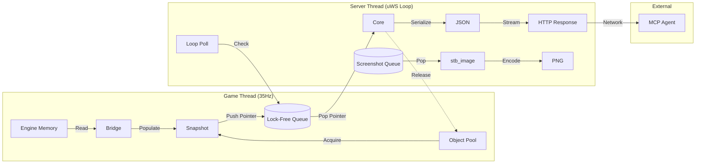

# DMCP (Doom Model Context Protocol) - Implementation Plan

**Version**: 12.0 (Released)
**Date**: 2025-11-20
**Target Engine**: UZDoom (GZDoom Fork)
**Standard**: C++17
**Protocol**: MCP Streamable HTTP (SSE + JSON-RPC 2.0)
**Build System**: CMake + vcpkg (Manifest Mode)

---

## 1. Executive Summary

DMCP is a high-performance C++ SDK acting as a "Sidecar" to Doom engines. It exposes real-time game state to AI agents via HTTP Server-Sent Events (SSE).

**Key Technical Decisions:**
*   **Memory Model**: **Zero-Alloc Steady State**. Heavy snapshot objects (containing vectors) are recycled via an **Object Pool** (`std::vector<Snapshot>`).
*   **Concurrency**: **Lock-Free SPSC Queue**. The Game Thread (Producer) and Server Thread (Consumer) exchange pointers.
*   **Networking**: **uWebSockets** (Async Event Loop). Handles high-frequency streaming.
*   **Architecture**: **Context-Based**. No global state in the core library. Reentrant and thread-safe.
*   **Integration**: **Interface Libraries**. Adapters are exposed as CMake `INTERFACE` targets, inheriting engine headers automatically.

---

## 2. Architecture Overview



---

## 3. Layer Design

| Layer | Component | Location | Responsibility | Dependencies |
| :--- | :--- | :--- | :--- | :--- |
| **1** | **Schema** | `include/dmcp/schema.hpp` | Data Contract (`Snapshot`, `Enemy`). | `std::vector` |
| **2** | **Core** | `src/dmcp.cpp` | Lifecycle, Threading, Object Pool, Queue. | `uWebSockets`, `json` |
| **3** | **Bridge** | `adapters/uzdoom/adapter.cpp` | Maps Engine Pointers -> Snapshot. | **Engine Headers** + SDK |

---

## 4. Folder Structure

Dependencies are managed by `vcpkg.json`.

```text
dmcp-sdk/
├── cmake/
│   └── dmcpConfig.cmake.in     # Package config
├── include/
│   └── dmcp/
│       ├── dmcp.h              # Public C API
│       ├── common.hpp          # Utilities
│       └── schema.hpp          # Data Contract
├── src/
│   ├── core/
│   │   ├── server.cpp          # uWebSockets App & Loop
│   │   ├── pool.hpp            # Recycling Object Pool
│   │   ├── png.hpp             # Image Encoding
│   │   └── screenshot.hpp      # Screenshot State
│   └── dmcp.cpp                # Main Entry Point
├── adapters/
│   └── uzdoom/
│       ├── adapter.cpp         # The Bridge
│       └── CMakeLists.txt      # Interface Target
├── examples/
│   └── dummy_server.cpp        # Validation Server
├── vcpkg.json                  # Dependency Manifest
├── CMakePresets.json           # Build Presets
├── CMakeLists.txt
└── README.md
```

---

## 5. The Build System

We use **vcpkg** in manifest mode.

**`vcpkg.json`**:
*   `nlohmann-json`
*   `usockets` (unofficial)
*   `uwebsockets` (unofficial)
*   `readerwriterqueue`
*   `stb`

**Build Commands**:
```bash
cmake --preset default
cmake --build --preset default
```

---

## 6. Completed Tasks

### Phase 1: Foundation (Data & Memory)
*   [x] **1.1**: **`schema.hpp`**: Define `Snapshot` struct.
*   [x] **1.2**: **`pool.hpp`**: Implement `SnapshotPool` using contiguous `std::vector` storage.

### Phase 2: Networking (uWS)
*   [x] **2.1**: **`server.cpp`**: Initialize `uWebSockets`.
*   [x] **2.2**: **Async**: Move screenshot encoding to server thread.
*   [x] **2.3**: **Safety**: Fix race conditions and deadlocks in shutdown.

### Phase 3: The Bridge (Adapter)
*   [x] **3.1**: **`adapters/uzdoom/adapter.cpp`**: Implement `PopulateSnapshot` using function composition.
*   [x] **3.2**: **CMake**: Expose as `dmcp::adapter::uzdoom` INTERFACE library.

### Phase 4: API Modernization
*   [x] **4.1**: **`dmcp.h`**: Introduce `dmcp_result_t`, `dmcp_stats_t`.
*   [x] **4.2**: **Context**: Replace global state with `dmcp_context_t`.
*   [x] **4.3**: **Callbacks**: Add `dmcp_log_callback_t`.

### Phase 5: Verification
*   [x] **5.1**: **`dummy_server`**: Create example application.
*   [x] **5.2**: **`test_mcp.sh`**: End-to-end validation script.

---

## 7. Integration Guide

### Step 1: Engine Build (`CMakeLists.txt`)
```cmake
# Add SDK
add_subdirectory(dmcp-sdk)
# Link Adapter (inherits dmcp core automatically)
target_link_libraries(uzdoom PRIVATE dmcp::adapter::uzdoom)
```

### Step 2: Startup (`d_main.cpp`)
```cpp
#include "dmcp/dmcp.h"
extern "C" void dmcp_adapter_setup();

void D_DoomInit() {
    // ...
    dmcp_adapter_setup();
}
```

### Step 3: Loop (`g_game.cpp`)
```cpp
extern "C" void dmcp_adapter_update();

void G_Ticker() {
    // ... game logic ...
    dmcp_adapter_update();
}
```

### Step 4: Shutdown (`d_main.cpp`)
```cpp
extern "C" void dmcp_adapter_shutdown();

void D_DoomMain() {
    // ...
    dmcp_adapter_shutdown();
}
```

--- END OF FILE plan.md ---
